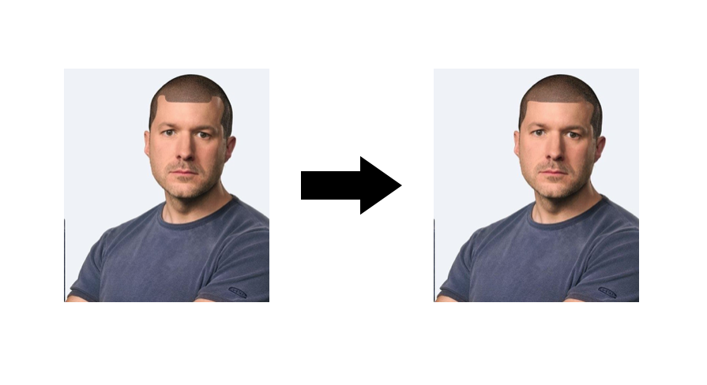
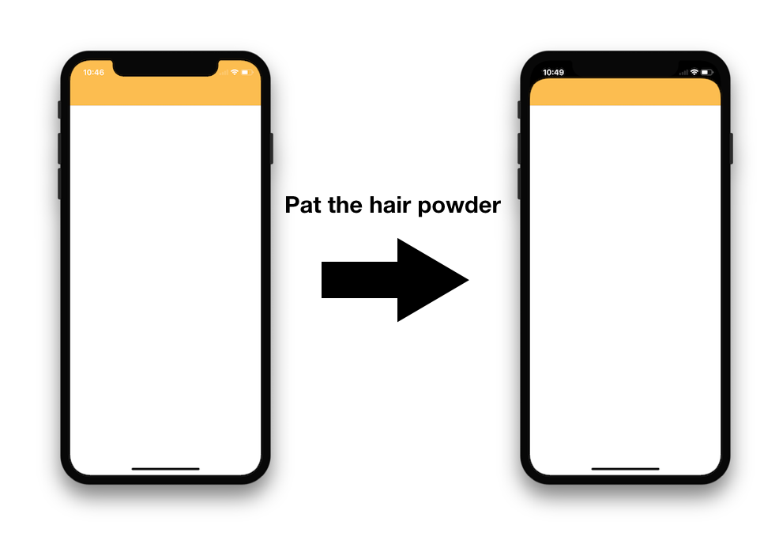
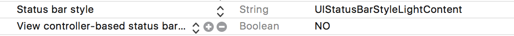

HairPowder (~FuckXDesign~)
==========


[](https://cocoapods.org/pods/HairPowder)

 
Hair Powder for iPhoneX "M" Shape pattern baldness design.
I hate iPhone X design. It can be rejected if you use this open source(https://developer.apple.com/ios/human-interface-guidelines/overview/iphone-x/). Use this If you don't care Guidelines


[Source](https://twitter.com/DasBule/status/910871022584434689)



## Install
### CocoaPods
Add `pod 'HairPowder'` to your Podfile.

##Usage

#### 1. add Status Bar style to info.plist


You also can put next code to info.plist directly
```plist
	<key>UIStatusBarStyle</key>
	<string>UIStatusBarStyleLightContent</string>
	<key>UIViewControllerBasedStatusBarAppearance</key>
	<false/>
```

#### 2. Run Powder Code
You Only have to is putting import and spread() function. 
```swift
import UIKit
import HairPowder

@UIApplicationMain
class AppDelegate: UIResponder, UIApplicationDelegate {
    var window: UIWindow?
    func application(_ application: UIApplication, didFinishLaunchingWithOptions launchOptions: [UIApplicationLaunchOptionsKey: Any]?) -> Bool {
        HairPowder.instance.spread()
        return true
    }
}

```
## LICENSE
HairPowder is under MIT license. See the [LICENSE](LICENSE) file for more info.